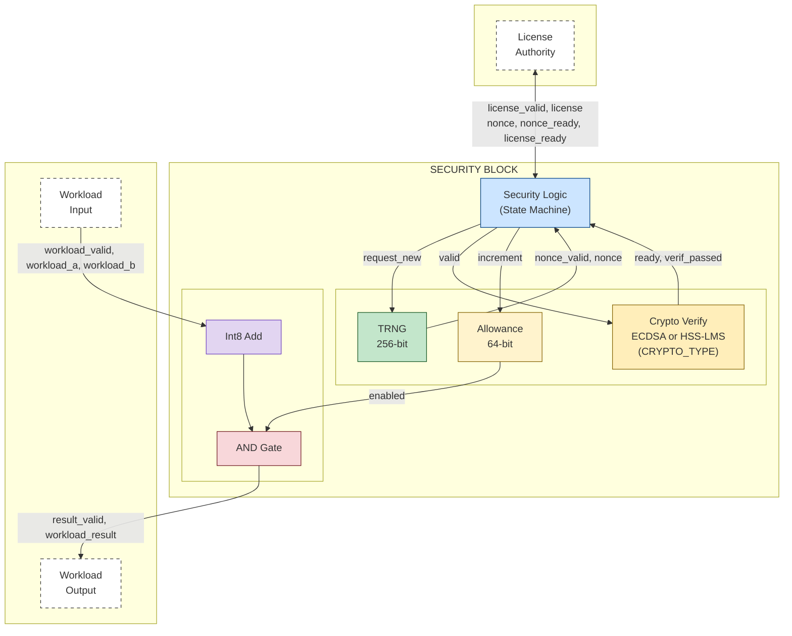
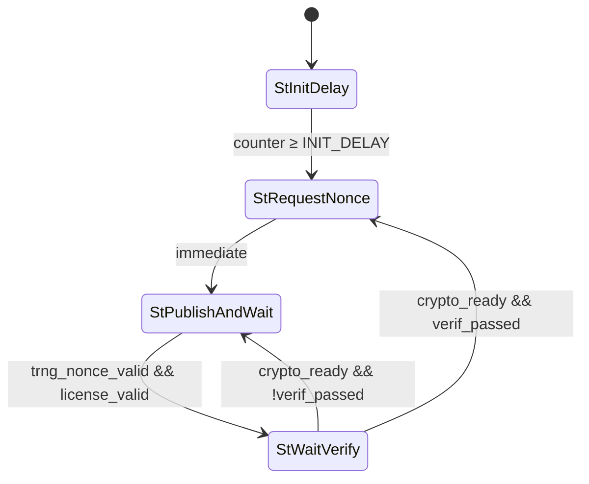
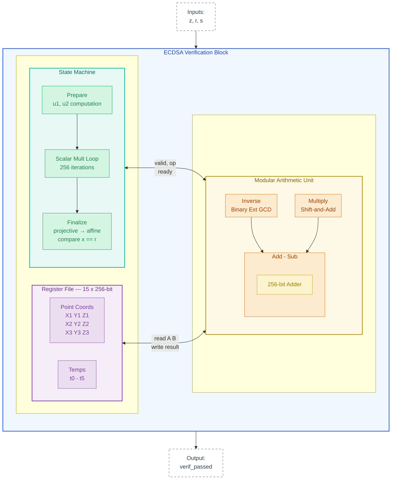
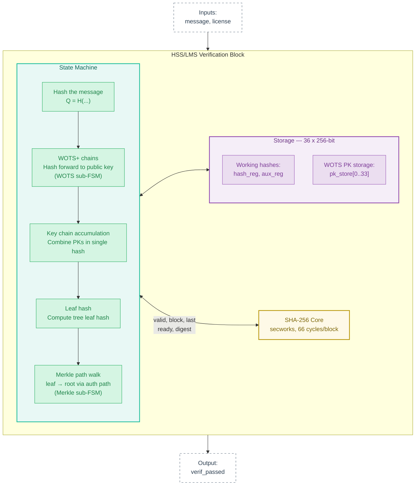

# Security Block Architecture

## Table of Contents
- [Purpose](#purpose)
- [Quickstart](#quickstart)
- [High-Level Block Diagram](#high-level-block-diagram)
- [Data Flow](#data-flow)
- [Trust Model](#trust-model)
- [Security Properties](#security-properties)
- [Interface Specification](#interface-specification)
- [State Machine](#state-machine)
- [ECDSA Verification Architecture](#ecdsa-verification-architecture)
- [HSS/LMS Verification Architecture](#hsslms-verification-architecture)
- [Timing Characteristics](#timing-characteristics)
- [Test Coverage](#test-coverage)
- [Prototype Limitations](#prototype-limitations)
- [Configuration Parameters](#configuration-parameters)
- [References](#references)

---

## Purpose

This security block implements a hardware-level "deadman's switch" for AI accelerators, based on the design described in Petrie (2025), [Embedded Off-Switches for AI Compute](https://arxiv.org/abs/2509.07637). The block gates essential chip operations, allowing them to proceed only when valid, cryptographically-signed authorization has been recently received.

The paper proposes embedding thousands of these security blocks throughout an AI chip, each independently verifying authorization. This prototype implements a single security block in SystemVerilog with a parameterised verification engine — at compile time it can be built with either:

- **ECDSA** over secp256k1 — the conventional choice analysed in the paper.
- **HSS/LMS** hash-based signatures (RFC 8554) — post-quantum-secure.

Both flavours are wired into the same `security_block` module via a `CRYPTO_TYPE` parameter (`0` = ECDSA, `1` = HSS-LMS), so the surrounding TRNG / allowance counter / workload-gating logic is identical.

### Design Goals

- **Fail-secure default**: Output is blocked unless explicitly authorized
- **Cryptographic authorization**: Only holders of the private key can generate valid licenses
- **Replay prevention**: Each license is valid for exactly one nonce
- **Time-based depletion**: Authorization expires over time without renewal


---

## Quickstart

#### Prerequisites

- **Verilator** (5.x+)
- **GNU Make**

#### Installation

```bash
# Install verilator if needed (macOS: brew install verilator, Ubuntu: apt install verilator)
# Note: apt install gets older version, build a newer from source if needed

# Clone the repo (recursively to pull the secworks SHA-256 submodule)
git clone --recursive https://github.com/JamesPetrie/off-switch
cd off-switch
```

#### Run Tests

```bash
cd verilog

# ECDSA top-level (CRYPTO_TYPE=0)
make sim TB=top_ecdsa

# HSS-LMS top-level (CRYPTO_TYPE=1)
make sim TB=top_hss
```

The two top-level testbenches (`tb_top_ecdsa.sv`, `tb_top_hss.sv`) instantiate `security_block` with the appropriate `CRYPTO_TYPE` parameter and run the same suite of integration tests.

---

## High-Level Block Diagram


*Security block architecture. The Int8 adder is a placeholder for actual chip operations (matrix multiplies, data routing, etc.). See Figure 3 in Petrie (2025) for the conceptual diagram this implements.*

### Module Summary

| Module | Type | Purpose |
|--------|------|---------|
| `trng` | Submodule | Nonce generation (256-bit LFSR in prototype; ring oscillator in production) |
| `ecdsa` | Submodule (CRYPTO_TYPE=0) | Signature verification using secp256k1 curve |
| `hss_verify` | Submodule (CRYPTO_TYPE=1) | RFC 8554 HSS/LMS verification (L=1, w=8, n=32, p=34) |
| Security Logic | Inline | State machine orchestration |
| Usage Allowance | Inline | 64-bit authorization counter |
| Workload | Inline | Gated essential operation (Int8 Add example) |

---

## Data Flow

### Authorization Flow

The authorization protocol follows Section 2 of the paper (see Figure 2):

1. TRNG generates nonce (at initialization or after valid license)
2. Security Logic latches and publishes nonce (`nonce_ready` = 1)
3. External authority reads nonce, signs it with private key
4. Authority submits `license` via valid-ready handshake (`license_valid`/`license_ready`)
5. The crypto engine verifies signature against nonce and hardcoded public key
6. **If valid:**
   - Allowance incremented
   - Return to step 1 (new nonce generated)
7. **If invalid:**
   - Allowance unchanged
   - Same nonce retained (allows retry with correct signature)
   - Return to step 2

### Workload Flow

1. Workload inputs (`workload_a`, `workload_b`) arrive with `workload_valid` = 1
2. Computation performed (Int8 addition, wrapping on overflow)
3. Output gating: each result bit ANDed with `enabled` signal
   - If `allowance > 0`: `enabled` = 1, result passes through
   - If `allowance = 0`: `enabled` = 0, result forced to zero
4. Result registered and output on next cycle

> **Note:** Allowance decrements every clock cycle regardless of workload activity, providing time-based authorization depletion as described in the paper's usage allowance properties.

---

## Trust Model

### Trust Boundaries

**Untrusted:**
- External license authority communication channel
- Workload inputs
- All signals crossing the security block boundary

**Trusted:**
- Crypto verification logic
- Hardcoded public key
- Allowance counter logic
- Output gating logic (AND gates)
- State machine transitions
- TRNG entropy source (ring oscillator in production)

### Trust Assumptions

1. The hardcoded public key corresponds to a secret held only by authorized parties.
2. The algortihm is cryptographically secure—an attacker cannot forge signatures without the secret.
3. The TRNG produces non-repeating nonces, preventing replay attacks. (Predictability is not a concern; uniqueness is.)
4. The hardware implementation faithfully reflects this RTL design (no manufacturing-time tampering).

The paper's Section 4 discusses attack vectors against these assumptions in detail, including physical tampering, side-channel attacks, and supply chain compromise.

---

## Security Properties

| Property | Description | Enforcement |
|----------|-------------|-------------|
| Output Gating | Workload output is 0 when unauthorized | `result & repeat(enabled)` |
| Cryptographic Authorization | Only valid signatures increment allowance | Crypto verification before increment |
| Replay Prevention | Each license valid for one nonce only | New nonce generated only after valid license accepted |
| Time-Based Depletion | Authorization depletes continuously | Allowance decrements every clock cycle |
| Fail-Secure Default | Allowance initializes to 0 on reset | Register default value; no license = no output |
| Retry Allowed | Invalid signatures allow retry with same nonce | State returns to Publish without changing nonce |
| No Double-Spend | Same license cannot be reused | Nonce changes immediately after valid license |

---

## Interface Specification

### Top-Level Inputs

| Signal | Width | Description |
|--------|-------|-------------|
| `clk` | 1 | System clock |
| `rst_n` | 1 | Asynchronous reset (active low) |
| `license_valid` | 1 | License submission request (hold until `license_ready`) |
| `license` | `LICENSE_W` | License payload |
| `workload_valid` | 1 | Workload input data valid |
| `workload_a` | 8 | Workload operand A |
| `workload_b` | 8 | Workload operand B |
| `trng_load_seed` | 1 | Load seed into TRNG (testing only) |
| `trng_seed` | 256 | Seed value for TRNG (testing only) |

`LICENSE_W` is selected at elaboration time from the `CRYPTO_TYPE` parameter:

| `CRYPTO_TYPE` | Engine | License struct (`license_t`) | Width |
|---------------|--------|------------------------------|-------|
| 0 | `ecdsa` (secp256k1) | `{r[256], s[256]}` | 512 bits |
| 1 | `hss_verify` (HSS/LMS) | `{leaf_index[32], randomizer[256], N x sig_chains[256], M x auth_path[256]}` | 10k+ bits |

### Top-Level Outputs

| Signal | Width | Description |
|--------|-------|-------------|
| `license_ready` | 1 | License verification complete (pulse) |
| `nonce` | 256 | Current nonce value |
| `nonce_ready` | 1 | Nonce is stable and ready for signing |
| `workload_result` | 8 | Gated workload output |
| `result_valid` | 1 | Result output is valid |
| `allowance` | 64 | Current allowance counter value |
| `enabled` | 1 | Allowance > 0 |

### TRNG Submodule Interface

| Direction | Signal | Width | Description |
|-----------|--------|-------|-------------|
| Input | `clk` | 1 | System clock |
| Input | `rst_n` | 1 | Asynchronous reset (active low) |
| Input | `enable` | 1 | Enable entropy counter |
| Input | `request_new` | 1 | Pulse to latch new nonce |
| Input | `load_seed` | 1 | Load seed (testing only) |
| Input | `seed` | 256 | Seed value (testing only) |
| Output | `nonce` | 256 | Latched nonce value |
| Output | `nonce_valid` | 1 | Nonce has been latched |

### ECDSA Submodule Interface

| Direction | Signal | Width | Description |
|-----------|--------|-------|-------------|
| Input | `clk` | 1 | System clock |
| Input | `rst_n` | 1 | Asynchronous reset (active low) |
| Input | `valid` | 1 | Start verification (hold until `ready`) |
| Input | `z` | 256 | Message hash (= nonce) |
| Input | `r` | 256 | Signature r component |
| Input | `s` | 256 | Signature s component |
| Output | `ready` | 1 | Verification complete (pulse) |
| Output | `verif_passed` | 1 | Signature is valid |

### HSS/LMS Verification Submodule Interface

| Direction | Signal | Width | Description |
|-----------|--------|-------|-------------|
| Input | `clk` | 1 | System clock |
| Input | `rst_n` | 1 | Asynchronous reset (active low) |
| Input | `valid` | 1 | Start verification (hold until `ready`) |
| Input | `message` | 256 | Message to verify (= nonce) |
| Input | `license` | `hss_pkg::license_t` | Full license (leaf index, randomizer, all WOTS+ sig chains, full auth path) |
| Output | `ready` | 1 | Verification complete (pulse) |
| Output | `verif_passed` | 1 | Signature is valid |

---

## State Machine

### State Diagram



### State Descriptions

| State | Entry Condition | Actions | Exit Condition |
|-------|-----------------|---------|----------------|
| `StInitDelay` | Reset | Increment delay counter | Counter ≥ `INIT_DELAY` |
| `StRequestNonce` | From `StInitDelay` or `StWaitVerify` (valid) | Pulse `request_new` to TRNG | Immediate (next cycle) |
| `StPublishAndWait` | From `StRequestNonce` or `StWaitVerify` (invalid) | Drive `nonce`, `nonce_ready` once `trng_nonce_valid`; wait for `license_valid` | `license_valid` |
| `StWaitVerify` | From `StPublishAndWait` | Assert `crypto_valid`; on `crypto_ready` pulse `license_ready`; if `verif_passed`, increment allowance | `crypto_ready` |

---

## ECDSA Verification Architecture



When `CRYPTO_TYPE = 0`, the security block uses ECDSA signature verification on the secp256k1 curve. This section describes the implementation; for background on why public-key cryptography is preferable to symmetric alternatives, see Section 3 of Petrie (2025).

### Verification Algorithm

ECDSA verification computes:

```
R = u₁·G + u₂·Q
```

where:
- `u₁ = z · s⁻¹ mod n`
- `u₂ = r · s⁻¹ mod n`
- `G` is the generator point (hardcoded)
- `Q` is the public key (hardcoded; `Q = 2G` in prototype)
- `z` is the message hash (= nonce in prototype)
- `(r, s)` is the signature

The signature is valid if `R.x mod n == r`.

### Scalar Multiplication via Shamir's Trick

Computing `u₁·G + u₂·Q` naively would require two separate scalar multiplications followed by a point addition. Instead, we use Shamir's trick (simultaneous multi-scalar multiplication) to process both scalars in a single pass through their bits.

For each bit position `i` from 255 down to 0:
1. **Double** the accumulator point `P`
2. **Add** a precomputed point based on the bit pair `(u₁[i], u₂[i])`:
   - `(0,0)`: add nothing
   - `(1,0)`: add `G`
   - `(0,1)`: add `Q`
   - `(1,1)`: add `G+Q` (precomputed)

This reduces the operation count from ~512 point additions to ~256 point additions plus ~256 doublings, with the doublings and additions unified through a complete addition formula.

### Complete Addition Formula

Point addition uses the complete addition formulas from Renes, Costello, and Batina (2016) in projective coordinates. These formulas:
- Handle all cases uniformly (including doubling, adding the point at infinity, and adding a point to its negation)
- Avoid branching on point values, which simplifies the state machine and improves side-channel resistance
- Require only field operations (add, subtract, multiply) with no inversions during the main loop

Each point addition/doubling executes a fixed sequence of 40 field operations, implemented as a microcode ROM:

```systemverilog
localparam instr_t PROGRAM [ROM_SIZE] = '{
    // ... Point addition (Renes-Costello-Batina, 40 steps) ...
    '{op: OP_MUL, src1: X1, src2: X2, dst: T0},   // t0 = X1·X2
    '{op: OP_MUL, src1: Y1, src2: Y2, dst: T1},   // t1 = Y1·Y2
    '{op: OP_MUL, src1: Z1, src2: Z2, dst: T2},   // t2 = Z1·Z2
    // ... 37 more operations ...
};
```

The formula uses 6 temporary registers (`t0`–`t5`) plus input/output point coordinates (`X1`–`Z3`), for a total of 15 registers. Curve constants `a` and `3b` are addressed as pseudo-registers but are hardcoded, not stored.

### Modular Arithmetic Unit

The `arith` module provides the four operations needed for elliptic curve arithmetic:

| Operation | Description | Algorithm |
|-----------|-------------|-----------|
| `add` | `(a + b) mod m` | Add with conditional subtraction |
| `sub` | `(a - b) mod m` | Subtract with conditional addition |
| `mul` | `(a · b) mod m` | Binary shift-and-add (256 iterations) |
| `inv` | `a⁻¹ mod m` | Binary Extended GCD |

All operations work over 256-bit operands and can use either the field prime `p` or curve order `n` as the modulus:
- Point arithmetic (during scalar multiplication) uses `mod p`
- Scalar preparation (`u₁`, `u₂` computation) and final comparison use `mod n`

The arithmetic unit interfaces with the register file. Operations are started by asserting `valid` and signal completion via `ready`. Typical cycle counts:
- Add/Sub: 2–3 cycles
- Mul: ~500-1000 cycles (bit-serial, varies with b input)
- Inv: ~2000–3000 cycles (varies with input)

### State Machine Overview

The ECDSA verification state machine proceeds through these phases:

**StPrepare** (3 operations, using `mod n`):
1. `w = s⁻¹ mod n`
2. `u₁ = z · w mod n`
3. `u₂ = r · w mod n`

**StAdd/StDouble** (2 × 256 bit positions × 40 ops each):
- For each bit position (MSB to LSB), add a selected point then double the accumulator
- Point selection via Shamir's trick: `G`, `Q`, `G+Q`, or infinity based on `(u₁[i], u₂[i])`
- Point at infinity handled via projective coordinates (`Z = 0`)

**StFinalize** (3 operations, using `mod p`):
1. `z_inv = Z⁻¹ mod p` (convert from projective to affine)
2. `x_affine = X · z_inv mod p`
3. `diff = x_affine - r mod p` (valid if `diff == 0`)

### Cycle Count

Total verification takes approximately 5 million cycles, dominated by the ~256 point operations in the scalar multiplication loop. At 1 GHz, this is in milliseconds—negligible compared to the licensing interval (minutes to days).

### Hardcoded Constants

The prototype hardcodes the following secp256k1 constants in `ecdsa_pkg`:
- Generator point `G` (from secp256k1 specification)
- Public key `Q = d · G`, where `d` is the private key (using `2G` for testing; would be chip-specific in production)
- Precomputed sum `GPQ = G + Q`
- Point at infinity `(0, 1, 0)` in projective coordinates
- Field prime `p = 2²⁵⁶ - 2³² - 977` (from secp256k1 specification)
- Curve order `n = 2²⁵⁶ - 432420386565659656852420866394968145599` (from secp256k1 specification)
- Curve parameters `a = 0`, `b = 7` (`y² = x³ + ax + b`, from secp256k1 specification)

In production, `Q` would be unique per chip (or per batch) and stored in Mask ROM, as recommended in the paper. The other constants are fixed by the secp256k1 specification.

### Prototype Simplifications

This implementation omits several features needed for production:

| Feature | Prototype | Production |
|---------|-----------|------------|
| Input validation | None | Check `r, s ∈ [1, n-1]` |
| Final reduction | None | Reduce `x_affine mod n` before comparison |
| Side-channel resistance | None | Constant-time field operations |
| Public key | Single hardcoded `Q` | Configurable via Mask ROM |

---

## HSS/LMS Verification Architecture



When `CRYPTO_TYPE = 1`, the security block uses HSS/LMS hash-based signature verification (RFC 8554) to validate licenses. HSS/LMS is a post-quantum scheme whose security relies solely on the collision resistance of SHA-256, making it resistant to attacks from quantum computers. For background on why public-key cryptography is preferable to symmetric alternatives, see Section 3 of Petrie (2025).

### Parameters

These constants live in `hss_pkg` and are fixed at elaboration time:

| Parameter | Value | Description |
|-----------|-------|-------------|
| `HSS_LEVELS` | 1 | Single Merkle tree (no multi-level HSS) — hardcoded |
| `WOTS_W` | 8 | Winternitz parameter — one chain per byte of the message digest |
| `WOTS_P1` | 32 | Message-digit chains (256 bits / 8 bits per chain) |
| `WOTS_P2` | 2 | Checksum chains |
| `WOTS_P` | 34 | Total WOTS+ chains |
| `MAX_HEIGHT` | 10 | Maximum Merkle tree height supported |
| `IDENTIFIER` | 128-bit constant | Tree identifier `I` (arbitrary, would be per-chip in production) |
| `ROOT_PUB_KEY` | 256-bit constant | Merkle root corresponding to the testbench private key |
| `TREE_HEIGHT` | 4 | ROOT_PUB_KEY's Merkle tree height |


### Verification Algorithm

For a signature on message `M` with randomizer `C`, leaf index `q`, identifier `I`:

1. **Q hash**: Hash the message
2. **WOTS+ chains**: `Q` is partitioned into 32 message digits plus 2 checksum digits. For each of the 34 chains `i`, hash from signature position `d[i]` up to position 254: The final value is the chain's public-key candidate `pk[i]`.
3. **Kc accumulation**: Combine the WOTS PKs into a single hash (1110 bytes → 18 blocks).
4. **Leaf hash**: Compute the Merkle tree leaf from the Kc hash
5. **Merkle path**: Walk from leaf to root using auth path siblings.
6. **Compare**: Computed root == configured root public key?.

### FSM overview

- **Sequencer FSM** — top-level walk through the six phase states plus `StIdle`/`StDone`.
- **WOTS sub-FSM** (`StWotsInit/Load/Hash/PkStore`) — drives the chain index, loads the digit from the combinational decomposition of the Q hash, runs each chain through SHA-256, and stores the resulting public-key candidate into `pk_store` for later use by `Kc`.
- **Merkle sub-FSM** (`StMrklInit/Hash`) — initialises `node_index` to, then walks up `TREE_HEIGHT` levels.

### SHA-256 Core

A single SHA-256 core is shared across all phases (Q, WOTS, Kc, Leaf, Merkle) — there is no parallel pipelining of WOTS+ and Kc. The block counter `blk_idx_q` together with `sha_last` drives multi-block sequencing.

The hash engine is the [secworks/sha256](https://github.com/secworks/sha256) Verilog core, included as a git submodule under `verilog/rtl/sha256/`.

- 3-state FSM: Idle -> Rounds (64 cycles) -> Done
- 66 cycles per 512-bit block (1 init + 64 rounds + 1 done)
- 16-register sliding window for W message schedule
- Supports multi-block hashing via `init`/`next` signals

`sha256_wrap.sv` adds a thin per block valid/ready handshake and a last signal to indicate if the current block closes the message or further blocks are coming.

### Cycle Count

Total verification takes approximately **300 K cycles**, dominated by WOTS+ chain computation:

| Phase | Cycles | Notes |
|-------|--------|-------|
| Q hash | ~132 | 2 SHA-256 blocks |
| WOTS+ chains | ~300 K | 34 chains × ~127 hashes avg |
| Kc accumulation | ~1000 | 18 SHA-256 blocks |
| Leaf hash | ~66 | 1 SHA-256 block |
| Merkle path (h=4) | ~528 | 4 levels × 2 blocks|
| Ooverhead | small | State transitions, flow control |

At 1 GHz, verification completes in ~0.3 ms, well within the licensing interval (minutes to days).

### Prototype Simplifications

| Feature | Prototype | Production |
|---------|-----------|------------|
| Public key | Single hardcoded | Per-chip via Mask ROM |
| HSS levels | `L = 1` (single Merkle tree, hardcoded) | `L = 2+` for a larger one-time-key space |
| License delivery | Single packed wide port | Streaming / serialised interface |
| Side-channel resistance | None | Constant-time SHA-256, power-analysis hardening |

---

## Timing Characteristics

| Operation | Cycles | Notes |
|-----------|--------|-------|
| Initialization delay | 100 | Configurable via `INIT_DELAY_CYCLES` |
| Nonce generation | 2 | Request + latch |
| License verification ECDSA | ~5×10⁶ | scalar multiplication dominates |
| License verification HSS-LMS | ~3×10⁵ | WOTS+ chains dominate |
| Workload operation | 1 | Combinational add + output register |
| Allowance per license | 10¹² | Configurable via `ALLOWANCE_INCREMENT` |

### Allowance Calculation

For a desired licensing period *T* seconds at clock frequency *f* Hz:

```
allowance_increment = T × f
```

**Examples at 1 GHz:**
- 1 hour: 3600 × 10⁹ = 3.6 × 10¹²
- 1 day: 86400 × 10⁹ = 8.64 × 10¹³
- 1 week: 604800 × 10⁹ = 6.05 × 10¹⁴

With 64-bit allowance counter, maximum value is 2⁶⁴ - 1 ≈ 1.8 × 10¹⁹, supporting approximately 584 years at 1 GHz.

The current default of 10¹² provides approximately 17 minutes of authorization per valid license at 1 GHz.

---

## Test Coverage

Both top-level testbenches exercise the same integration scenarios via the shared `security_block` interface; only the licence format and signing approach differ.

### Test Cases

| # | Test Name | Description | Property |
|---|-----------|-------------|----------|
| 1 | Initial state | Allowance = 0, enabled = false | Fail-secure |
| 2 | Workload blocked | Output = 0 when allowance = 0 | Output gating |
| 3 | State machine | Reaches Publish state with valid nonce | State machine |
| 4 | Valid license | Allowance increments | Crypto auth |
| 5 | Workload unblocked | Correct result after valid license | Output gating |
| 6 | Invalid license | Allowance unchanged, same nonce retained | Crypto auth, retry |
| 7 | Int8 positive | 50 + 30 = 80 | Workload |
| 8 | Int8 negative | -10 + -20 = -30 | Workload |
| 9 | Int8 mixed | 100 + -30 = 70 | Workload |
| 10 | Int8 wrapping | 127 + 1 = -128 | Workload |
| 11 | Allowance decrement | Decreases by 100 over 100 cycles | Time depletion |
| 12 | New nonce | Generated after valid license only | Replay prevention |
| 13 | Wrong nonce | License for different nonce rejected | Crypto auth |
| 14 | Replay attack | Same license rejected on second use | No double-spend |
| 15 | New signature, old nonce | Re-signing a stale nonce is rejected (HSS-only for now) | No double-spend |

### Property Coverage Matrix

| Property | T1 | T2 | T4 | T5 | T6 | T11 | T12 | T13 | T14 | T15 |
|----------|:--:|:--:|:--:|:--:|:--:|:---:|:---:|:---:|:---:|:---:|
| Output Gating | ● | ● | | ● | | | | | | |
| Crypto Authorization | | | ● | | ● | | | ● | ● | ● |
| Replay Prevention | | | | | | | ● | | ● | |
| Time-Based Depletion | | | | | | ● | | | | |
| Fail-Secure Default | ● | ● | | | | | | | | |
| Retry Allowed | | | | | ● | | | | | |
| No Double-Spend | | | | | | | | | ● | ● |

---

## Prototype Limitations

This is a proof-of-concept implementation. The paper discusses broader limitations of the approach in Section 6, and Table 1 catalogs hardware attack vectors and countermeasures.

| Component | Prototype | Production |
|-----------|-----------|------------|
| TRNG | 256-bit LFSR | Ring oscillator(s) with XORed entropy |
| public key | Hardcoded | Configurable via Mask ROM |
| ECDSA curve | secp256k1 only | Multiple curves for redundancy |
| ECDSA Input validation | Minimal | Full range checking |
| HSS levels | `L = 1` | `L ≥ 2` for larger key space |
| HSS license delivery | Single wide packed port | Streaming / serial interface with on-chip buffering |
| Redundancy | Single block | Thousands of independent blocks per chip |

---

## References

Petrie, J. (2025). Embedded Off-Switches for AI Compute. *arXiv preprint* arXiv:2509.07637. https://arxiv.org/abs/2509.07637

Renes, J., Costello, C., & Batina, L. (2016). Complete addition formulas for prime order elliptic curves. *EUROCRYPT 2016*.

McGrew, D., Curcio, M., & Fluhrer, S. (2019). Leighton-Micali Hash-Based Signatures. *RFC 8554*. https://www.rfc-editor.org/rfc/rfc8554

Cooper, D. A., et al. (2020). Recommendation for Stateful Hash-Based Signature Schemes. *NIST SP 800-208*. https://nvlpubs.nist.gov/nistpubs/SpecialPublications/NIST.SP.800-208.pdf

SECG (2010). *SEC 2: Recommended Elliptic Curve Domain Parameters*, Version 2.0 (secp256k1). https://www.secg.org/sec2-v2.pdf
